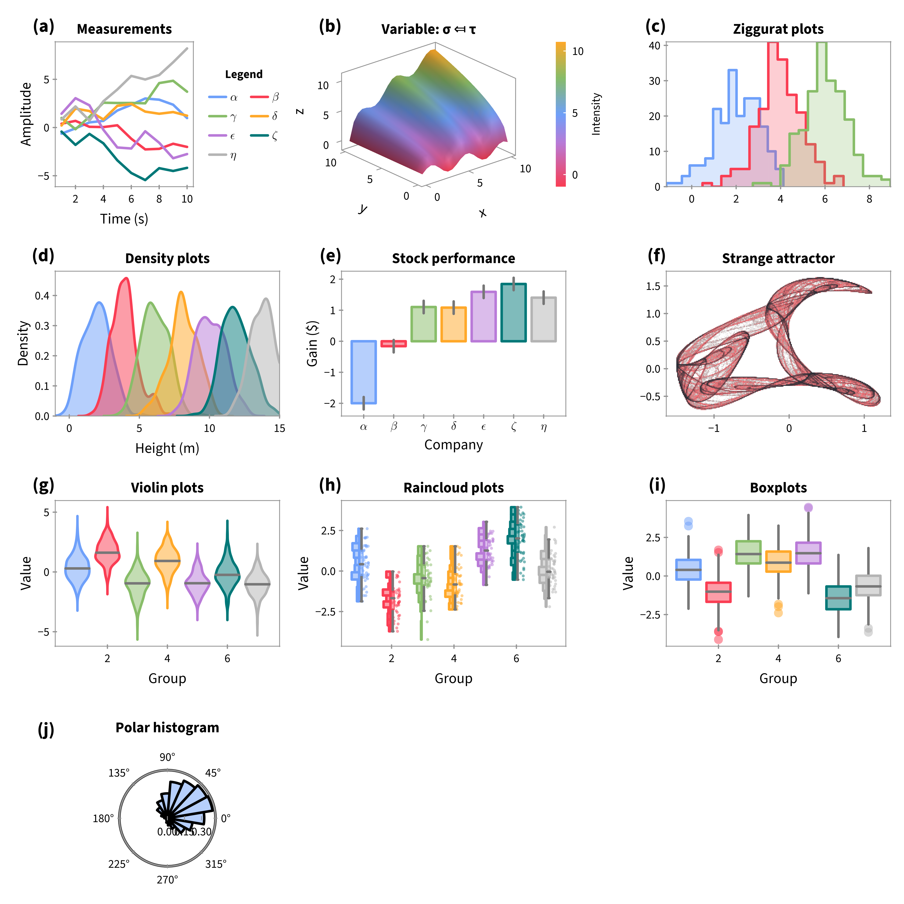
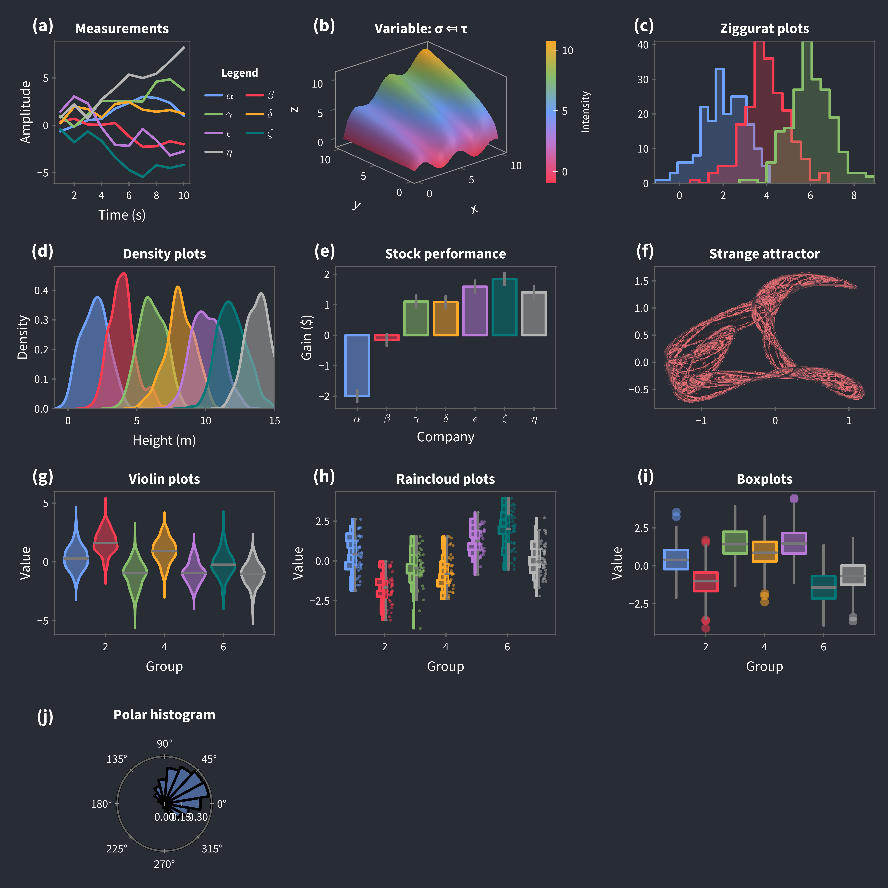
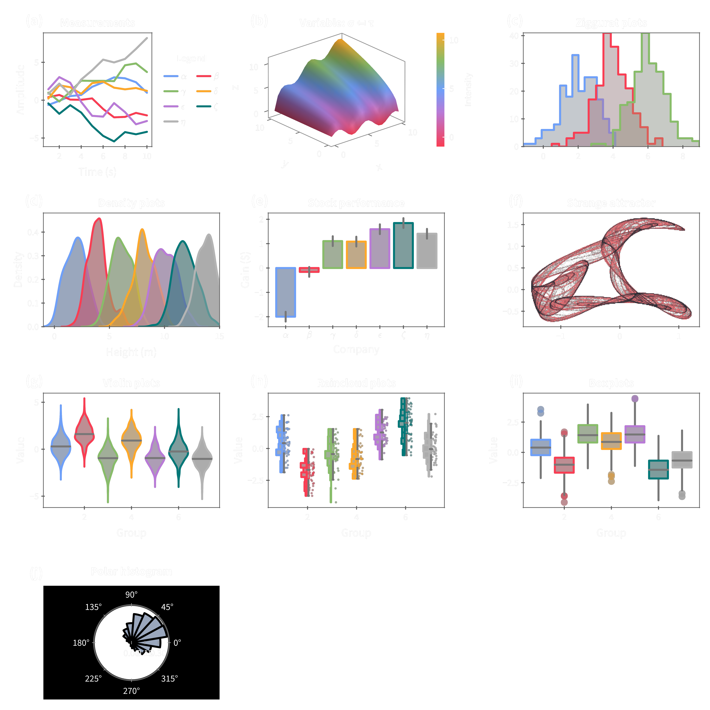
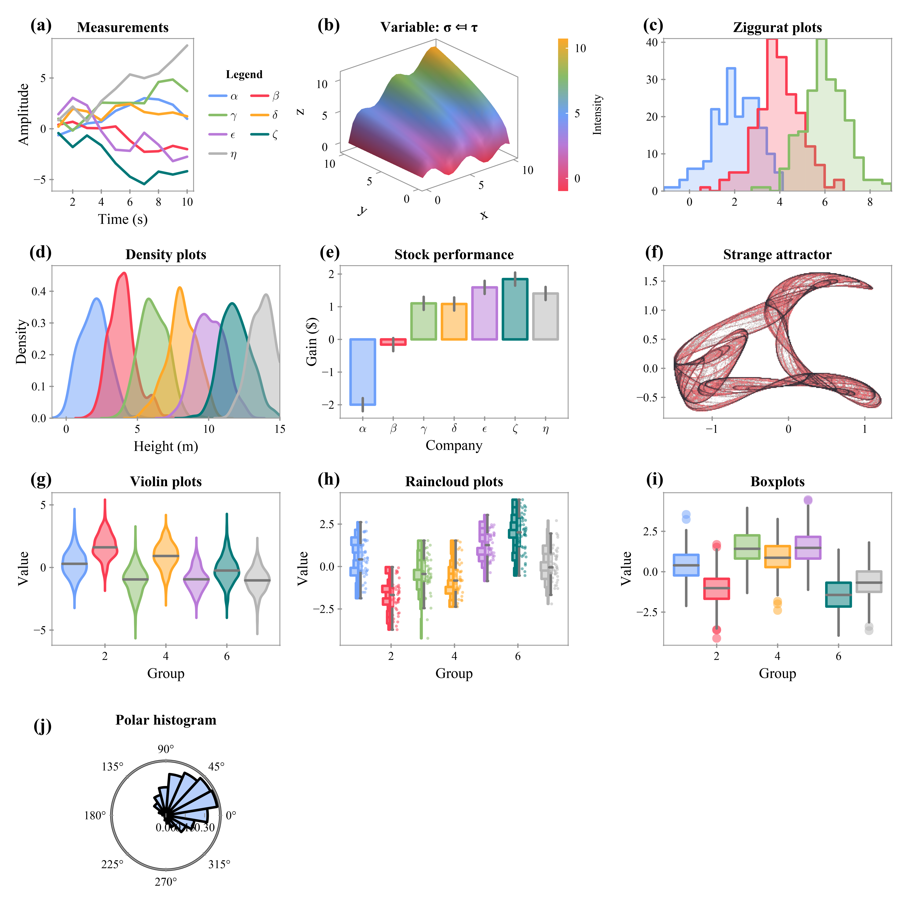
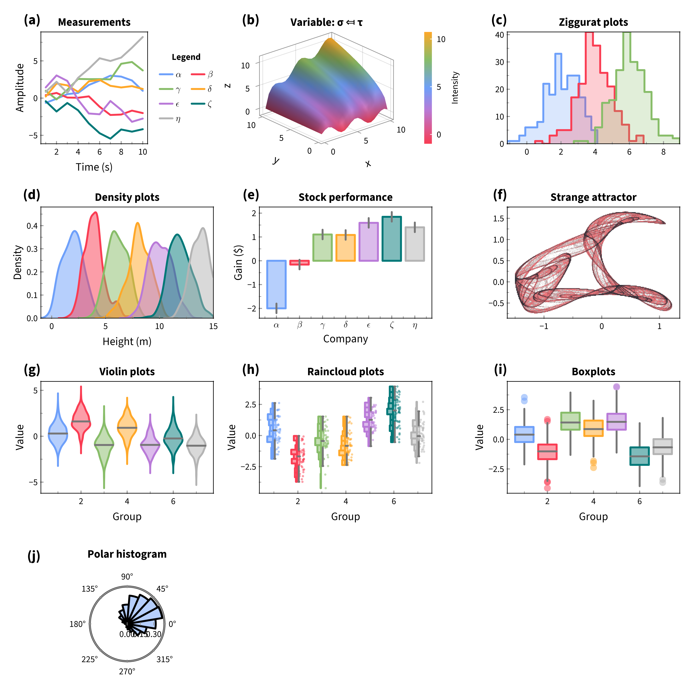

# Fathom.jl

[](https://brendanjohnharris.github.io/Fathom.jl/dev/)
[](https://github.com/brendanjohnharris/Fathom.jl/actions/workflows/CI.yml?query=branch%3Amain)
[](https://codecov.io/gh/brendanjohnharris/Fathom.jl)
[](https://github.com/fredrikekre/Runic.jl)

A Makie theme and some utilities.
# Usage
```Julia
using CairoMakie
using Fathom
fathom() |> Makie.set_theme!
fig = Fathom.demofigure()
```


## Theme options
Any combination of the keywords below can be used to customise the theme.
### Dark
```Julia
fathom(:dark, :transparent) |> Makie.set_theme!
fig = Fathom.demofigure()
```


### Transparent
```Julia
fathom(:dark, :transparent) |> Makie.set_theme!
fig = Fathom.demofigure()
```


### Serif
```Julia
fathom(:serif) |> Makie.set_theme!
fig = Fathom.demofigure()
```


### Physics
```Julia
fathom(:physics) |> Makie.set_theme!
fig = Fathom.demofigure()
```


# Utilities

### addlabels!

Add labels to a provided grid layout, automatically searching for blocks to label.

```julia
f = Fathom.demofigure()
addlabels!(f)
display(f)
```

### seethrough

Converts a color gradient into a transparent version.

```julia
C = cgrad(:viridis)
transparent_gradient = seethrough(C)
```

### scientific

Generate string representation of a number in scientific notation with a specified number of significant digits.

```julia
scientific(1/123.456, 3) # "8.10 × 10⁻³"
```

There is also an `lscientific` method, which returns a LaTeX string:
```julia
lscientific(1/123.456, 3) # "8.10 \\times 10^{-3}"
```

### brighten and darken

Brighten a color by a given factor by blending it with white:

```julia
brighten(baikal, 0.2) # Brightens the color by 20%
```

Or, darken a color by blending it with black:
```julia
darken(baikal, 0.2) # Darkens the color by 20%
```

### widen

Slightly widens an interval by a fraction δ.

```julia
x = (0.0, 1.0)
wider_interval = Fathom.widen(x, 0.1)
```

### freeze!

Freezes the axis limits of a Makie figure.
```julia
fig, ax, plt = scatter(rand(10), rand(10))
freeze!(ax)
```

### clip

Copies a Makie figure to the clipboard.
```julia
fig, ax, plt = scatter(rand(10), rand(10))
clip(fig)
```

### importall

Imports all symbols from a module into the current scope. Use with caution.
```julia
importall(Fathom) .|> eval
```

# Colors
The theme is based on the colors `[baikal, bermejo, qinghai, seohae, ianthina]`:


It also provides the following colormaps:
#### sunrise

#### cyclicsunrise

#### sunset

#### darksunset

#### lightsunset

#### binarysunset

#### cyclic

#### pelagic


# Recipes
The following recipes are exported:

- `polarhist`
- `polardensity`
- `covellipse`
- `prism`
- `ziggurat`
- `hill`
- `bandwidth`

Details and examples can be found in the [recipes docs](https://brendanjohnharris.github.io/Fathom.jl/dev/recipes/).
